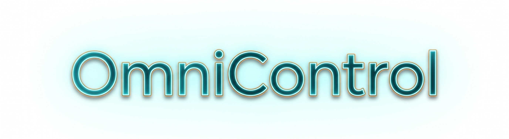
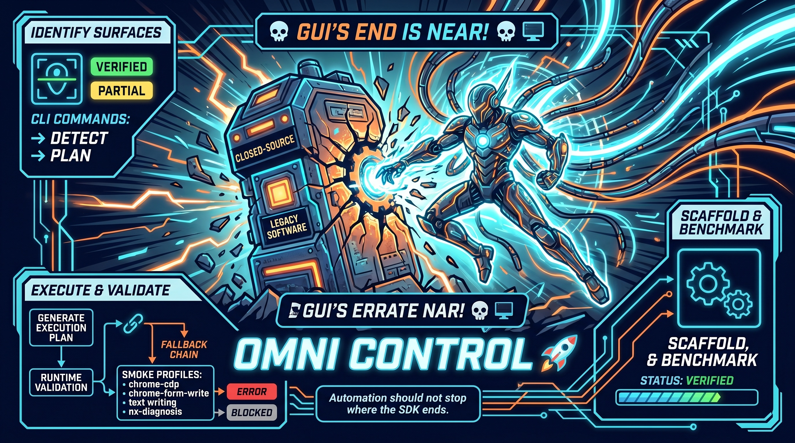

<h1 style="display: flex; align-items: center; gap: 12px;">
  
  <span>OmniControl</span>
</h1>

<p align="center">
  
</p>

<p align="center">
  <strong>AUTOMATION BEYOND THE SDK.</strong>
</p>

<p align="center">
  English | <a href="./README.zh-CN.md">简体中文</a>
</p>

<p align="center">
  
</p>

> **GUI is not long for this world. 💀🖥️ Automation should not stop where the SDK ends.**
>
> Most software was never designed for automation.  
> It has no perfect API, no complete plugin surface, no unified scripting entrypoint.  
> That does not mean it cannot be integrated.
>
> **OmniControl** helps automation systems first identify which control surfaces a target exposes, then choose the most stable execution path, fallback chain, and verification method.

---

## What OmniControl Is 🚀

OmniControl is a **control-surface-first** automation control layer and scaffolder.

It does not assume a single automation stack, and it does not assume every target will expose a friendly API.  
Instead, it breaks automation into three more realistic questions:

1. **What control surfaces does this target expose?**
2. **Which path is the most stable, and where should it fall back if it fails?**
3. **Which scripting language best fits that path?**

Then OmniControl generates for that target:

- executable path planning
- primary and fallback adapters
- lightweight manifests and script templates
- runtime smoke entrypoints where verification is needed

---

## Why OmniControl ⚠️

Today many automation systems assume one thing:

**The software will cooperate.**

Reality does not work that way.

Some software is best approached through native scripting.  
Some is better through plugins or a vendor CLI.  
Some targets can only be controlled indirectly through file-format writes.  
In web contexts, CDP is sometimes the most stable path.  
And for certain desktop apps, the final fallback is UI automation or vision.

The real question is never just "can it be automated?"  
The real questions are:

- **Which control path should we use?**
- **How do we degrade safely when the primary path breaks?**
- **How do we verify that the result actually took effect instead of merely looking successful?**

OmniControl is built for that problem.

---

## What You Can Use It For 🔥

OmniControl helps automation systems and agents:

- identify likely control surfaces exposed by a target
- choose a more stable primary path for a target and task
- design fallback chains instead of betting everything on a single interface
- choose a scripting language based on the control surface rather than tool bias
- generate lightweight manifests and script templates
- attach runtime smoke where needed so plans are verified against reality
- represent real execution outcomes as structured states instead of only "success / failure"

Supported outcome states include:

- `ok`
- `partial`
- `blocked`
- `error`

---

## The Core Idea 🧠

OmniControl does not treat automation as a single technical problem.  
It acts more like a **control-surface router**:

- first identify what a target exposes
- then select the most reliable path
- then decide language and execution form
- finally verify what actually happened

Its default bias is:

- **control-surface first**, not source-code first
- **verification first**, not command-first
- **path first**, not interface dogma
- **language follows the control surface**, not the other way around
- **pivot is allowed**, instead of turning a broken primary path into total failure

---

## CLI ⚙️

OmniControl exposes five top-level commands:

- `detect`
- `plan`
- `scaffold`
- `benchmark`
- `smoke`

Help:

```bash
python -m omnicontrol --help
python -m omnicontrol smoke --help
```

## Quick Start

```bash
cd OmniControl

python -m omnicontrol detect "SomeDesktopApp" --platform windows --kind desktop --need ui
python -m omnicontrol plan "https://example.com" --kind web --need browser --need dom --json
python -m omnicontrol scaffold "LegacyDesktopApp" --platform windows --kind desktop --need ui --output .\generated\legacy-app
```

## Benchmark Configs

`benchmark` consumes a JSON file that describes local targets and expected planning outcomes.

Minimal example:

```json
{
  "items": [
    {
      "name": "sample_web_target",
      "target": "https://example.com",
      "platform": "windows",
      "kind": "web",
      "needs": ["browser", "dom"],
      "expected_primary": "cdp",
      "expected_language": "typescript"
    }
  ]
}
```

Run it with:

```bash
python -m omnicontrol benchmark .\my-benchmark.json --json
```

## Runtime Smoke

`smoke` is the runtime verification entrypoint.
Profiles are intentionally targeted rather than universal. Depending on the profile, a run may validate:

- file export or file-format writes
- CDP read/write flows
- desktop UI automation checks
- vendor CLI or native-script entrypoints
- workflow-style multi-step verification
- diagnose flows that may return `partial` instead of hard failure

Examples:

```bash
python -m omnicontrol smoke chrome-cdp --json
python -m omnicontrol smoke chrome-form-write --json
python -m omnicontrol smoke word-write --json
python -m omnicontrol smoke nx-diagnose --json
```

## Design Principles

- Control-plane first, not source-code first.
- Verification-first, not command-execution-first.
- Thin scaffolds by default, deeper runtime paths only where justified.
- Language choice should follow the control surface, not a single-language bias.
- Public repo content should stay free of local machine traces and internal working notes.

## Repository Layout

- `omnicontrol/`: package source
- `tests/`: unit tests
- `pyproject.toml`: packaging and CLI entrypoint

Runtime outputs such as `smoke-output/`, `benchmark-output/`, caches, and learned local state are intentionally not tracked.

## Boundaries

OmniControl is not a general-purpose RPA platform.

- It does not promise universal GUI discovery and end-to-end automation for arbitrary applications.
- Its CDP and runtime integrations are lightweight, profile-oriented entrypoints rather than full vendor SDK wrappers.
- Some profiles require locally installed third-party software and environment-specific setup.
- Internal research notes, local benchmark inventories, and machine-specific runtime traces are intentionally excluded from the public repository.

## Development

Install in editable mode:

```bash
pip install -e .
```

Run a lightweight test slice:

```bash
python -m unittest tests.test_invocation tests.test_staging tests.test_transports
```
